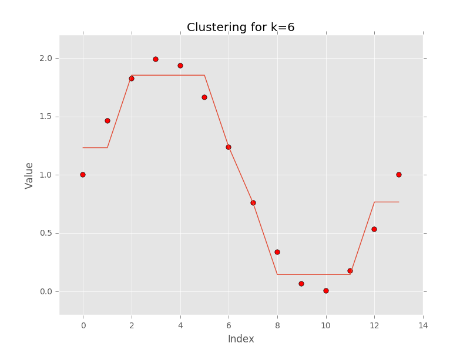

piecewisesegmentation
=====================

.. image:: https://pyup.io/repos/github/pidefrem/piecewisesegmentation/shield.svg
     :target: https://pyup.io/repos/github/pidefrem/piecewisesegmentation/
     :alt: Updates

Exact piecewise regression methods based on dynamic programming.

Features
--------

* Exact piecewise constant regression over 2D curve with `k` segments.

Dependencies
------------

* numpy

License
-------

This work is licensed under a [BSD 3](LICENSE) license.
